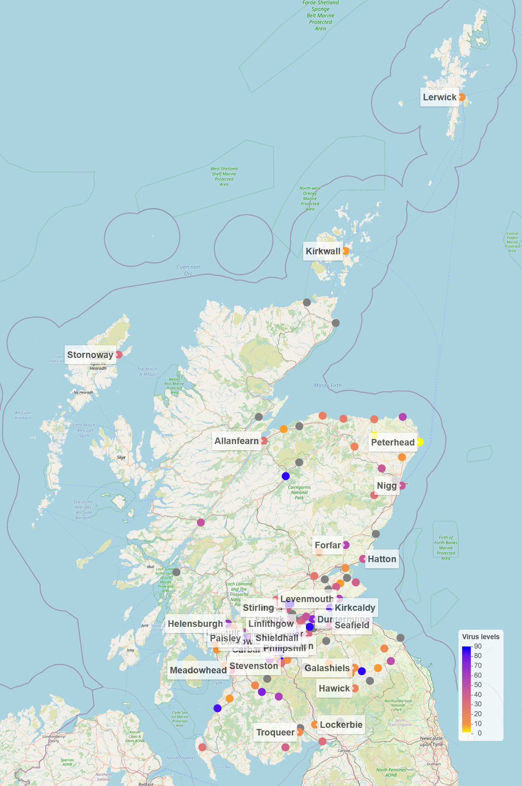
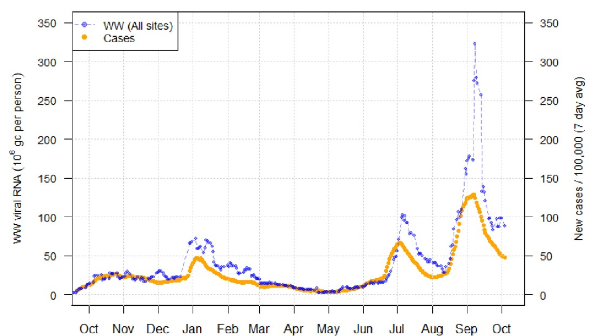



##  An overview 

Image by Fusion Medical Animation on Unsplash

 Severe acute respiratory syndrome coronavirus 2 (SARS‑CoV‑2) is the virus that causes the respiratory illness COVID-19, responsible for the ongoing COVID-19 pandemic.
Studies of infected patients have shown that SARS-CoV-2 RNA can be detected in the faeces of patients for weeks after the onset of clinical signs.

Since May 2020, the Scottish Environment Protection Agency (SEPA) has been monitoring fragments of coronavirus’ ribonucleic acid (RNA) in local wastewater samples with the backing of Scottish Government and Public Health Scotland (PHS), alongside Scottish Water, CREW (Centre of expertise for Waters) and academic partners from the University of Edinburgh’s Roslin Institute and Heriot Watt University. It has been shown that the concentrations of virus in the wastewater correlates with the number of cases reported across the country. The data from prevalence of SARS-CoV-2 viral RNA has since been used by the Scottish Government to model the spread and level of Covid-19.

Researchers at the University of Edinburgh also investigated whether different variants of SARS-CoV-2 can be detected and quantified in wastewater. This opens up the possibility to provide real-time data to PHS and related agencies to monitor and respond to new variants. 
 
The SARS-CoV-2 prevalence in wastewater dataset for the period of May 2020 to February 2022 is  published in [Scientific Data](https://www.nature.com/articles/s41597-022-01788-3)

The SARS-CoV-2 in wastewater monitoring programme is still ongoing and levels of the virus are frequently reported on [SEPA's dashboard](https://informatics.sepa.org.uk/RNAmonitoring/). 
  
 |Sampling locations for COVID detection wastewater ||
 |:-:|:-:|
 | [*click for an interactive map*](./geo-map-interactive.html)  ||
|Daily new case rates with samples taken up until 4th October 2021|:-:|
||:-:|

##  &#9759; Here are some useful links 





